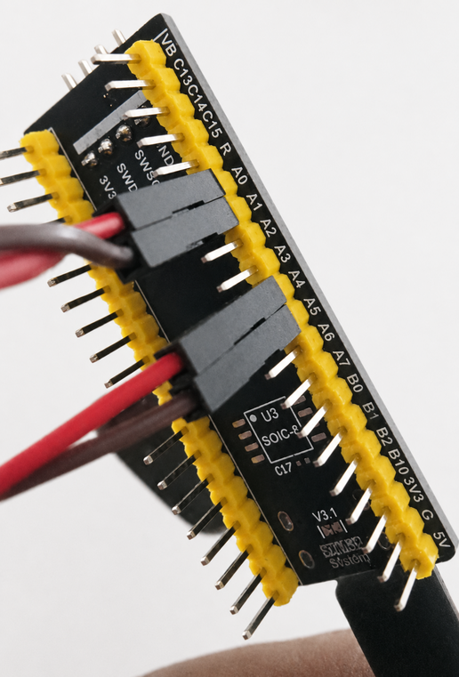

# Hardware Setup: STM32 DAC–ADC Loopback

## Board

The experiment uses an **STM32U585CIU6 mini core board** programmed with the Arduino framework through PlatformIO.

The board generates test sine waves using its DAC pins, reads them back using ADC pins, runs the DSP algorithm in firmware, and sends both the applied input and generated output samples to the PC over USB serial.

## Loopback Wiring

The current loopback wiring is:

```text
PA4 / A4  -> PA0 / A0
PA5 / A5  -> PA1 / A1
GND       -> GND
```

PA4 and PA5 are used as two DAC outputs.  
A0 and A1 are used as ADC inputs.

# Why Test on Real Hardware Instead of Just Simulating

This repo runs DSP algorithm on a real STM32 board with a DAC-ADC loopback,
instead of only simulating the same DSP algorithm in MATLAB or Python. Here's why
that's worth doing.

## 1. Real hardware rounds numbers, simulation doesn't

A simulation uses near-perfect precision (64-bit floats). The real board
only has 12-bit DAC/ADC (4096 steps total). That rounding adds small errors
that a simulation will never show you.

## 2. The DAC trick might not be perfectly balanced in real life

The signal generator uses two DAC pins that are supposed to cancel out to
make a bipolar-looking signal. On paper this cancels exactly. In real
hardware, the two DAC channels are never perfectly matched, so there's some
leftover error. Only real hardware can show you how big that error is.

## 3. Timing isn't perfect on real hardware

The code tries to sample at exactly 1000 Hz, but on real hardware it
sometimes misses the deadline (this is why the firmware counts
`missed_deadlines` and reports `actual_fs`). A simulation samples at a
perfect, fixed rate and can't show you this kind of timing error.

## 4. The real chip doesn't do math exactly like our PC

Our PC uses double-precision math. The STM32 uses single-precision floats
and its own FPU. Rounding can build up differently across several DSP algorithm
stages on the real chip compared to a simulation on our laptop.

## 5. One test checks the whole chain, not just the math

Simulation only checks our DSP algorithm equations. The real test checks
everything at once: the DAC, the wiring, the ADC, and the firmware timing.
If a wire is loose or a pin is misconfigured, the real test will show a bad
result — a simulation would just show a perfect result and hide the problem.

## 6. It's good practice before building closed-loop (HIL) systems

If you later build a real closed-loop test (controller + simulated plant,
i.e. HIL), we can reuse the same DAC/ADC/timing setup. By testing it now on a
on a real ardware, we can catch hardware problems early.

## 7. It proves our math actually matches reality

The math behind the signal generation and measurement is correct on paper.
But "correct on paper" and "works correctly on real hardware" are two
different things. This test proves the second one. A simulation can only
ever prove the first.

## Quick comparison

| | Simulation only | Real hardware test (this repo) |
|---|---|---|
| Precision | Near-perfect | Real 12-bit rounding |
| DAC balance | Assumed perfect | Actually measured |
| Timing | Perfectly fixed | Real jitter, reported |
| Math | PC-style double precision | Chip's real float math |
| What's tested | Just the DSP equations | DAC + wiring + ADC + firmware, all together |
| Use for later HIL work | No head start | Proves the hardware chain already works |
| Proves | The math is self-consistent | The math matches real hardware |
