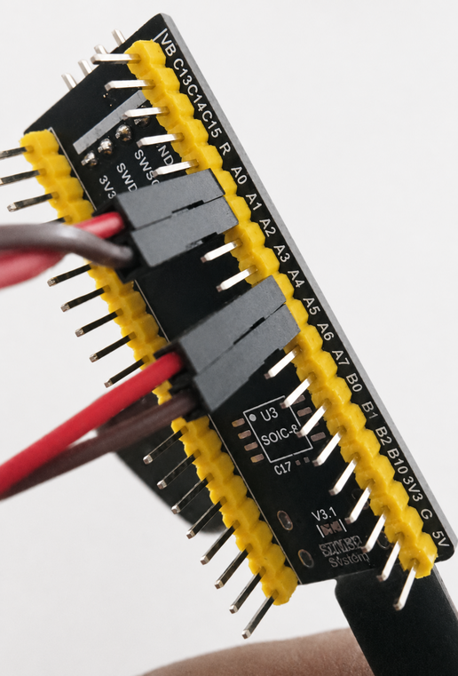
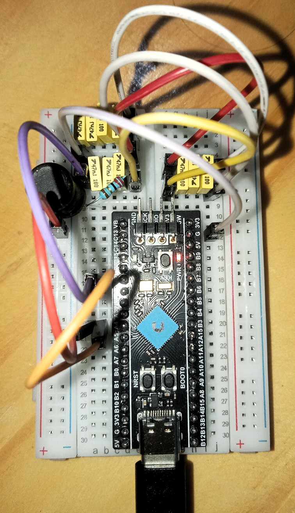

# Hardware Setup: STM32 DAC–ADC Loopback

## Board

The experiment uses an **STM32U585CIU6 mini core board** programmed with the Arduino framework through PlatformIO.

The board can be used in two related configurations:

1. a direct **DAC–ADC loopback** for testing signal generation, acquisition, timing, and DSP on real hardware; and
2. a **DAC–RLC–ADC system-identification setup**, where a physical RLC network is inserted between the DAC and ADC.

The STM32 generates the excitation waveform, acquires the applied input and plant output, and sends the measured samples to the PC over USB serial. The Python host performs the frequency-response estimation and visualization.

## Direct Loopback Wiring

The original loopback wiring is:

```text
PA4 / A4  -> PA0 / A0
PA5 / A5  -> PA1 / A1
GND       -> GND
```

PA4 and PA5 are used as two DAC outputs.  
A0 and A1 are used as ADC inputs.

---

# RLC System Identification

The same STM32U585 board can also be used as a compact frequency-response measurement platform by inserting a physical RLC network between the DAC and ADC.

The signal path is:

```text
DAC -> RLC plant -> ADC
```

The STM32 acts mainly as a deterministic waveform generator and data-acquisition device, while the Python host performs the system-identification calculations.

## Hardware Photo



## RLC Wiring

The current RLC setup uses:

```text
                    R              L
PA4 / DAC1_OUT1 ---/\/\----------LLLL----------+---- Vc
        |                                       |
        |                                       C
        |                                       |
PA1 / ADC -------------------------------- Vin  |
                                                |
PA0 / ADC --------------------------------------+ 
                                                |
                                               GND
```

A less compact but more explicit view is:

```text
                    R = 22 ohm       L = 250 mH
PA4 / DAC1_OUT1 ---o---/\/\/\/-------LLLL---------o---- Vc
                   |                              |
                   |                              |
PA1 / ADC ----------                              C = 470 nF
        Vin                                        |
                                                   |
PA0 / ADC -----------------------------------------o
        Vc                                         |
                                                  GND
```

### STM32 pin assignments

| STM32U585 pin | Function | Connection |
|---|---|---|
| **PA4 / DAC1_OUT1** | Excitation DAC | Drives the series RLC network |
| **PA1 / ADC** | Input measurement | Measures the actual applied input voltage, `Vin` |
| **PA0 / ADC** | Output measurement | Measures the capacitor voltage, `Vc` |
| **GND** | Common reference | Connected to the RLC ground |

The important point is that **PA1 measures the real DAC voltage applied to the plant**. The transfer function is therefore calculated from the measured input rather than from the commanded DAC value.

## Current RLC values

| Component | Value |
|---|---:|
| External resistor | **22 ohm** |
| Inductor | **250 mH** |
| Inductor internal resistance | approximately **300 ohm** |
| Capacitor | **470 nF** |
| Capacitor implementation | 10 x 47 nF in parallel |

The 22-ohm external resistor gives a much clearer resonance than the earlier 470-ohm configuration because the total series damping is lower.

---

# Frequency-Response Measurement

Two excitation methods are currently supported.

## 1. Stepped sine

The STM32 generates one sine-wave frequency at a time using the DAC. Both `Vin` and `Vc` are sampled and returned to Python.

For each frequency, the Python host estimates the complex response

$$
H(f) = \frac{V_c(f)}{V_{in}(f)}
$$

and plots

$$
20\log_{10}|H(f)|
$$

together with the phase difference.

With the present 22-ohm RLC configuration, the measured resonance is approximately:

- **resonant frequency:** about **410 Hz**
- **peak magnitude:** about **5.9 dB**

## 2. PRBS broadband identification

A pseudo-random binary sequence (PRBS) can excite many frequencies in a single experiment.

The STM32 generates a deterministic two-level waveform around the DAC bias voltage:

$$
v_{DAC}[n] = V_{bias} + A u[n]
$$

where

$$
u[n] \in \{-1,+1\}.
$$

The Python host estimates the frequency response from the measured input and output spectra. A useful estimator is

$$
H_1(f) = \frac{S_{yx}(f)}{S_{xx}(f)}.
$$

Compared with a stepped-sine sweep, PRBS can recover a broad frequency response from a much shorter experiment.

For the current setup, a **PRBS13** sequence has

$$
2^{13}-1 = 8191
$$

samples per period. At 50 ksample/s, one period lasts about 164 ms.

In experiment, the PRBS-derived response closely overlays the stepped-sine response through the useful measurement range, including the resonance near 410 Hz. At high frequency, where the RLC output is strongly attenuated, the PRBS estimate becomes noisier because the measured output approaches the ADC/noise floor.

---

# Host Software

The Python GUI supports multiple measurement methods through a method selector.

Current methods:

- **Stepped Sine**
- **PRBS**

Each completed run is retained on the Matplotlib Bode plots. New runs use different plot colors automatically, allowing results from different methods or different RLC component values to be compared directly.

The GUI also provides:

- stacked magnitude and phase curves;
- zoom and pan;
- run labels and legends;
- **Clear plots**;
- **Save all CSV**.

This makes it possible to use the stepped-sine result as a reference and directly compare it with broadband identification methods such as PRBS.

---

# Why Test on Real Hardware Instead of Just Simulating

This repo runs DSP and system-identification experiments on a real STM32 board with DAC and ADC interfaces instead of only simulating the same algorithms in MATLAB or Python.

## 1. Real hardware rounds numbers, simulation doesn't

A simulation uses near-perfect numerical precision. The real board has finite DAC/ADC resolution, so quantization and converter errors appear in the measurement.

## 2. Real DAC and ADC channels are not ideal

DAC gain, ADC gain, offsets, converter noise, and channel mismatch are real hardware effects. Measuring `Vin` directly allows these effects to be included in the experimental transfer-function estimate rather than assuming an ideal excitation.

## 3. Timing isn't perfect on real hardware

A simulation samples at a perfectly fixed interval. Real firmware has execution time, interrupt latency, communication overhead, and possible sampling jitter.

The high-rate RLC acquisition code therefore initializes the ADC once and uses a lightweight acquisition path rather than repeatedly calling the higher-overhead Arduino `analogRead()` wrapper.

## 4. The real chip doesn't do math exactly like our PC

A PC normally uses double-precision arithmetic for analysis. Embedded firmware may use single-precision floating-point or integer operations, so numerical behavior can differ.

## 5. One test checks the whole chain, not just the equations

The real experiment checks:

```text
waveform generation
        ->
DAC
        ->
physical wiring / RLC plant
        ->
ADC
        ->
USB acquisition
        ->
Python estimation
```

A wiring problem, converter limitation, timing problem, or incorrect pin configuration will appear in the measured result.

## 6. It is useful preparation for closed-loop and HIL experiments

The same DAC/ADC/timing infrastructure can later be reused for controller testing, plant identification, and hardware-in-the-loop experiments.

## 7. It connects mathematical models with measured behavior

The RLC transfer function can be derived analytically, simulated numerically, and measured directly using the same physical circuit. Comparing those results provides a useful bridge between control theory, embedded systems, and experimental system identification.

## Quick comparison

| | Simulation only | Real hardware test |
|---|---|---|
| Precision | Near-perfect numerical representation | Real DAC/ADC quantization and noise |
| Excitation | Ideal mathematical waveform | Real DAC waveform, also measured by ADC |
| Timing | Perfectly fixed | Real embedded timing |
| Plant | Mathematical model | Physical RLC network |
| What's tested | Equations/algorithm | DAC + wiring + plant + ADC + firmware + host |
| Frequency response | Computed from model | Experimentally identified |
| Use for later HIL work | Limited hardware validation | Hardware chain already exercised |
| Proves | Model is internally consistent | Model can be compared with real measured behavior |

---

# References

1. K. J. Åström and B. Wittenmark, *Computer-Controlled Systems: Theory and Design*, 3rd ed., Prentice Hall, 1997.

2. T. Bose and S. Mitra, “System identification and filtering using pseudo random binary inputs,” *Journal of the Franklin Institute*, vol. 329, no. 4, pp. 765–774, 1992.  
   DOI: https://doi.org/10.1016/0016-0032(92)90087-W

3. S. W. Sung and J. H. Lee, “Pseudo-random binary sequence design for finite impulse response identification,” *Control Engineering Practice*, vol. 11, no. 8, pp. 935–947, 2003.  
   DOI: https://doi.org/10.1016/S0967-0661(03)00035-2

4. J. N. Davidson, D. A. Stone, and M. P. Foster, “Minimum gain identifiable when pseudo-random binary sequences are used for system identification in noisy conditions,” *Electronics Letters*, vol. 49, no. 22, pp. 1388–1389, 2013.  
   DOI: https://doi.org/10.1049/el.2013.1034
