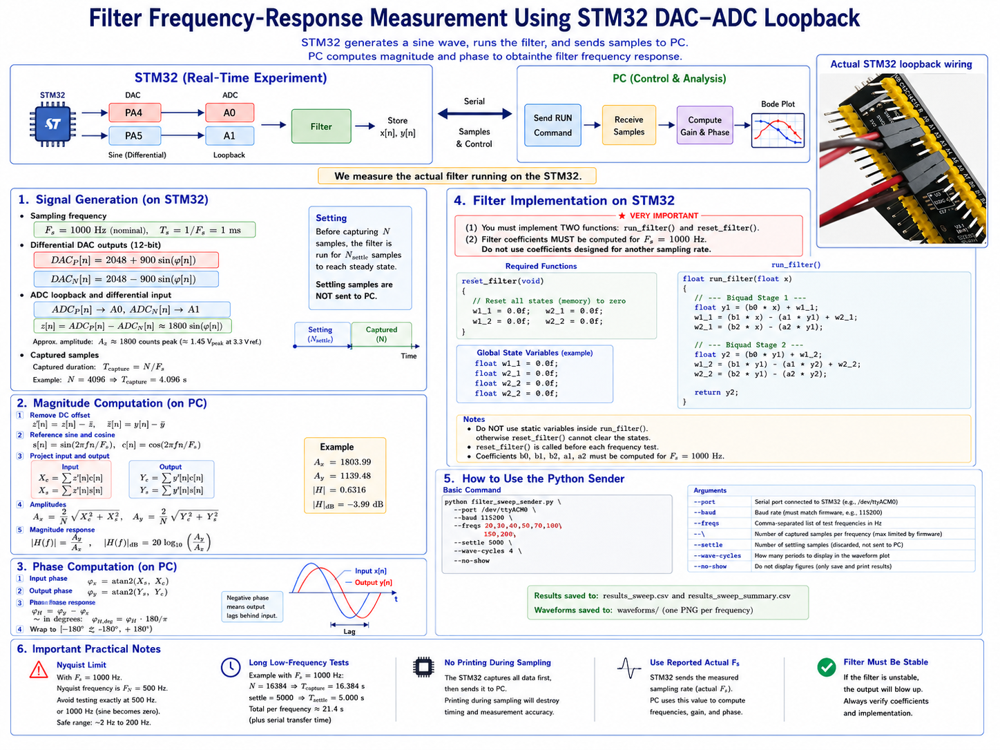

# Filter Frequency-Response Measurement Using STM32 DAC–ADC Loopback


## Super short technical summary

This note documents the signal generation and PC-side frequency-response estimation used to validate a filter running on an STM32 board.

The STM32 performs the real-time experiment:

```text
DAC sine generation -> ADC loopback -> filter -> store x[n], y[n]
```

The PC controls the sweep and computes the frequency response:

```text
PC sends RUN command -> STM32 returns samples -> PC computes gain and phase
```

The Python script running on the PC sends the desired sweep frequencies one by one and waits for the STM32 response.

For each test frequency, the STM32 injects approximately a pure sine wave into the filter. The PC then asks:

> How much of that same sine frequency exists in the input, and how much exists in the output?

The amplitude ratio gives the magnitude response:

$$
|H(f)| = \frac{\text{output amplitude}}{\text{input amplitude}}.
$$

The phase difference gives the phase response:

$$
\angle H(f) = \text{output phase} - \text{input phase}.
$$

Repeating this process for many frequencies produces an experimental Bode plot.

## Summary in poster




## How to Use the Sender Script

The sender script controls the STM32 over serial. It sends one command per frequency:

```text
RUN <freq_hz> <N> <settle_N>
```

For example:

```text
RUN 10 4096 1000
```

means:

```text
frequency  = 10 Hz
N          = 4096 captured samples
settle_N   = 1000 settling samples before capture
```

The STM32 then replies with:

```text
OK,<freq_hz>,<N>,<settle_N>
BEGIN,<effective_f_hz>,<actual_fs_hz>,<N>,<missed_deadlines>
DATA,0,<x0>,<y0>
DATA,1,<x1>,<y1>
...
END
```

where:

```text
x[n] = measured input signal
y[n] = filter output signal
```

The PC uses these returned samples to compute magnitude and phase.


### Basic usage with explicit frequency list

Use this when you want to manually choose the frequencies:

```bash
python filter_sweep_sender.py \
  --port /dev/ttyACM0 \
  --baud 115200 \
  --freqs "2,5,10,20,50,100,200" \
  --n 4096 \
  --settle 1000
```

This measures exactly:

```text
2 Hz, 5 Hz, 10 Hz, 20 Hz, 50 Hz, 100 Hz, 200 Hz
```


### 0.2 Linear sweep using minimum, maximum, and step

Use this when you want an evenly spaced frequency sweep:

```bash
python filter_sweep_sender_with_waveforms.py \
  --port /dev/ttyACM0 \
  --baud 115200 \
  --fmin 2 \
  --fmax 200 \
  --fstep 5 \
  --n 4096 \
  --settle 1000
```

This generates:

```text
2, 7, 12, 17, ..., 197 Hz
```

The values are generated as:

$$
f = f_{\min},\; f_{\min}+f_{\text{step}},\; f_{\min}+2f_{\text{step}},\;\ldots
$$

until the value reaches or passes \(f_{\max}\).


### Example of practical command

For the current firmware, use:

```bash
python filter_sweep_sender_with_waveforms.py \
  --port /dev/ttyACM0 \
  --baud 115200 \
  --freqs "2,5,10,20,50,100,200" \
  --n 4096 \
  --settle 1000 \
  --wave-cycles 4
```

This will:

1. command STM32 to test each frequency,
2. receive the captured input and output signals,
3. compute amplitude, gain, and phase,
4. save a summary CSV file,
5. save Bode magnitude and phase plots,
6. save waveform images showing input vs output for each frequency.


### Output files

By default, the script creates an output folder:

```text
sweep_output/
```

Inside it, the script saves:

```text
sweep_output/sweep_summary.csv
sweep_output/magnitude_response.png
sweep_output/phase_response.png
sweep_output/raw_<frequency>Hz.csv
sweep_output/waveforms/waveform_<frequency>Hz.png
```

The summary file contains one row per tested frequency:

```text
f_hz, fs_hz, n_samples, gain, gain_db, phase_deg, amp_in, amp_out, skipped_lines
```

The raw CSV file for each frequency contains:

```text
n, t_s, x, y
```

where:

```text
n   = sample index
t_s = time in seconds
x   = measured input
y   = measured output
```

The waveform images show a few cycles of the input and output signals. The number of shown cycles is controlled by:

```bash
--wave-cycles 4
```


### Other useful options

Disable interactive plot windows and only save images:

```bash
--no-show
```

Do not save raw sample CSV files:

```bash
--no-raw
```

Do not save waveform images:

```bash
--no-waveforms
```

Change the output folder:

```bash
--out my_sweep_result
```

Example:

```bash
python filter_sweep_sender_with_waveforms.py \
  --port /dev/ttyACM0 \
  --baud 115200 \
  --freqs "2,5,10,20,50,100,200" \
  --n 4096 \
  --settle 1000 \
  --wave-cycles 4 \
  --out sweep_lowpass_test \
  --no-show
```


### Meaning of `N` and `settle`

The command:

```text
RUN f N settle_N
```

does **not** mean that the first `settle_N` samples are removed from `N`.

Instead, STM32 performs two separate stages:

```text
settle_N samples -> generated and filtered, but not stored
N samples        -> generated, filtered, stored, and sent to PC
```

For example:

```text
RUN 2 4096 1000
```

means the STM32 runs:

$$
1000 + 4096 = 5096
$$

samples in total.

The first 1000 samples are only for settling and are discarded inside the STM32 firmware. The PC receives only the final 4096 captured samples.

With

$$
F_s = 1000\;\text{Hz},
$$

we get:

$$
T_{\text{settle}} = \frac{1000}{1000} = 1.000\;\text{s},
$$

and

$$
T_{\text{capture}} = \frac{4096}{1000} = 4.096\;\text{s}.
$$

So for this command, the total experiment time per frequency is approximately:

$$
T_{\text{total}} = 1.000 + 4.096 = 5.096\;\text{s},
$$

but only the last 4.096 seconds are sent to the PC and used for frequency-response estimation.


## Signal Generation

### Sampling frequency

The STM32 uses a fixed nominal sampling frequency

$$
F_s = 1000 \; \text{Hz}
$$

so the sampling period is

$$
T_s = \frac{1}{F_s} = 1 \; \text{ms}.
$$

For each sample index \(n\), the sine phase is advanced by

$$
\Delta \phi = 2\pi \frac{f}{F_s},
$$

where \(f\) is the requested test frequency.

The phase is updated as

$$
\phi[n+1] = \phi[n] + \Delta \phi.
$$

When \(\phi\) exceeds \(2\pi\), it is wrapped back into the range \([0,2\pi)\).


### Differential DAC generation

The STM32 DAC cannot generate negative voltage. Therefore, the signal is generated using two DAC channels centered at midscale.

The firmware uses:

```cpp
const int DAC_MID = 2048;
const int DAC_AMP = 900;
```

For a 12-bit DAC, the output range is:

$$
0 \leq DAC \leq 4095.
$$

The first DAC output is:

$$
DAC_P[n] = 2048 + 900\sin(\phi[n]),
$$

and the second DAC output is:

$$
DAC_N[n] = 2048 - 900\sin(\phi[n]).
$$

The physical voltages are always positive and remain safely inside the DAC range.

Assuming a 3.3 V reference, one DAC count corresponds approximately to:

$$
\frac{3.3}{4095} \approx 0.806 \; \text{mV}.
$$

So each DAC channel has approximately:

$$
900 \times 0.806 \; \text{mV} \approx 0.725 \; \text{V peak}
$$

around midscale.


### ADC loopback and differential input

The wiring is:

```text
PA4 / A4  -> PA0 / A0
PA5 / A5  -> PA1 / A1
GND       -> GND
```

The ADC reads both DAC loopback signals:

$$
ADC_P[n] \leftarrow DAC_P[n]
$$

$$
ADC_N[n] \leftarrow DAC_N[n].
$$

The input signal used by the filter is the difference:

$$
x[n] = ADC_P[n] - ADC_N[n].
$$

Substituting the two DAC equations gives:

$$
x[n] \approx (2048 + 900\sin\phi[n]) - (2048 - 900\sin\phi[n]).
$$

Therefore:

$$
x[n] \approx 1800\sin\phi[n].
$$

So the effective digital input amplitude is approximately:

$$
A_x \approx 1800 \; \text{counts peak}.
$$

In voltage-equivalent form:

$$
1800 \times \frac{3.3}{4095} \approx 1.45 \; \text{V peak}.
$$

This is the amplitude observed by the PC script, where typical measured input amplitudes are around 1800 counts.


### 1.4 Captured signal length

If the PC requests \(N\) captured samples, then the captured duration is:

$$
T_{\text{capture}} = \frac{N}{F_s}.
$$

For example, with:

$$
N = 4096
$$

and:

$$
F_s = 1000 \; \text{Hz},
$$

we get:

$$
T_{\text{capture}} = \frac{4096}{1000} = 4.096 \; \text{s}.
$$

The number of captured sine cycles is:

$$
N_{\text{cycles}} = f T_{\text{capture}}.
$$

For example, at \(f=10\) Hz:

$$
N_{\text{cycles}} = 10 \times 4.096 = 40.96 \; \text{cycles}.
$$

The firmware also runs a settling interval before capture. These samples are used to let the filter reach steady state, but they are not sent to the PC.


## Magnitude Computation

The PC receives two sampled signals from the STM32:

$$
x[n] = \text{measured input signal},
$$

$$
y[n] = \text{filter output}.
$$

For each test frequency \(f\), the PC estimates the amplitude of the input and output at that same frequency.

Because the injected frequency is already known, a full FFT is not required. Instead, the PC uses synchronous detection, also known as single-frequency sine/cosine projection.


### Remove DC offset

Before estimating amplitude and phase, the mean value is removed:

$$
\tilde{x}[n] = x[n] - \bar{x},
$$

$$
\tilde{y}[n] = y[n] - \bar{y}.
$$

This removes any residual ADC offset, DAC offset, or filter output offset.


### Reference sine and cosine

The PC constructs reference signals at the test frequency:

$$
s[n] = \sin\left(2\pi f \frac{n}{F_s}\right),
$$

$$
c[n] = \cos\left(2\pi f \frac{n}{F_s}\right).
$$

The angular frequency in discrete-time form is:

$$
\omega = 2\pi \frac{f}{F_s}.
$$

So equivalently:

$$
s[n] = \sin(\omega n),
$$

$$
c[n] = \cos(\omega n).
$$


### Input amplitude

The input signal is projected onto the reference sine and cosine:

$$
X_s = \sum_{n=0}^{N-1} \tilde{x}[n]s[n],
$$

$$
X_c = \sum_{n=0}^{N-1} \tilde{x}[n]c[n].
$$

The input amplitude is then estimated as:

$$
A_x = \frac{2}{N}\sqrt{X_s^2 + X_c^2}.
$$

This gives the peak amplitude of the sine component at frequency \(f\).


### Output amplitude

The same calculation is performed for the filter output:

$$
Y_s = \sum_{n=0}^{N-1} \tilde{y}[n]s[n],
$$

$$
Y_c = \sum_{n=0}^{N-1} \tilde{y}[n]c[n].
$$

The output amplitude is:

$$
A_y = \frac{2}{N}\sqrt{Y_s^2 + Y_c^2}.
$$


### Magnitude response

The magnitude response of the filter at frequency \(f\) is:

$$
|H(f)| = \frac{A_y}{A_x}.
$$

In decibels:

$$
|H(f)|_{\text{dB}} = 20\log_{10}\left(\frac{A_y}{A_x}\right).
$$

For example, if:

$$
A_x = 1803.99
$$

and:

$$
A_y = 1139.48,
$$

then:

$$
|H(f)| = \frac{1139.48}{1803.99} = 0.6316,
$$

and:

$$
|H(f)|_{\text{dB}} = 20\log_{10}(0.6316) \approx -3.99 \; \text{dB}.
$$


## Phase Computation

The sine and cosine projections also provide phase information.


### Input phase

The input phase is estimated from the input sine/cosine projections:

$$
\phi_x = \operatorname{atan2}(X_c, X_s).
$$

This gives the phase of the input signal relative to the generated sine reference.


### Output phase

The output phase is similarly estimated as:

$$
\phi_y = \operatorname{atan2}(Y_c, Y_s).
$$


### Filter phase response

The filter phase response is the output phase minus the input phase:

$$
\phi_H = \phi_y - \phi_x.
$$

The result is usually converted to degrees:

$$
\phi_{H,\text{deg}} = \phi_H \frac{180}{\pi}.
$$

Then the phase is wrapped to the interval:

$$
-180^\circ \leq \phi_{H,\text{deg}} < 180^\circ.
$$

A negative phase means the output lags behind the input. This is expected for a low-pass filter.


## Important Practical Notes

### Avoid Nyquist and exact sampling aliases

With:

$$
F_s = 1000 \; \text{Hz},
$$

the Nyquist frequency is:

$$
F_N = \frac{F_s}{2} = 500 \; \text{Hz}.
$$

Testing exactly 500 Hz is problematic because:

$$
\sin\left(2\pi \frac{500}{1000}n\right) = \sin(\pi n) = 0
$$

for integer \(n\). Therefore, the generated sine almost disappears.

Testing exactly 1000 Hz is also invalid because:

$$
\sin\left(2\pi \frac{1000}{1000}n\right) = \sin(2\pi n) = 0.
$$

For the current 1000 Hz sampling rate, a safe frequency range is approximately:

$$
2 \; \text{Hz} \leq f \leq 200 \; \text{Hz}.
$$


### Do not print during sampling

Serial printing is slow and non-deterministic. Therefore, the STM32 does not print during the real-time sampling loop.

The firmware first captures all samples into RAM:

```text
x_buf[n], y_buf[n]
```

Only after capture is complete does the STM32 send the data to the PC.

This keeps the timing of the DAC, ADC, and filter execution clean.


### Actual sampling frequency

The firmware reports the measured sampling rate:

```text
BEGIN,effective_f_hz,actual_fs,N,missed_deadlines
```

The PC should use the reported `actual_fs` and `effective_f_hz`, not only the nominal sampling frequency. This improves accuracy if the actual loop timing differs slightly from the nominal value.


## Summary


The STM32 generates two opposite DAC sine waves:

$$
DAC_P[n] = 2048 + 900\sin(\omega n),
$$

$$
DAC_N[n] = 2048 - 900\sin(\omega n).
$$

The ADC loopback input is computed as:

$$
x[n] = ADC_P[n] - ADC_N[n].
$$

This produces a centered sine wave with approximately:

$$
A_x \approx 1800 \; \text{counts peak}.
$$

The filter output is:

$$
y[n] = \text{filter}(x[n]).
$$

The PC estimates the input and output amplitudes using sine/cosine projection:

$$
A_x = \frac{2}{N}\sqrt{X_s^2 + X_c^2},
$$

$$
A_y = \frac{2}{N}\sqrt{Y_s^2 + Y_c^2}.
$$

The magnitude response is:

$$
|H(f)| = \frac{A_y}{A_x},
$$

or in decibels:

$$
|H(f)|_{\text{dB}} = 20\log_{10}\left(\frac{A_y}{A_x}\right).
$$

The phase response is:

$$
\angle H(f) = \operatorname{atan2}(Y_c,Y_s) - \operatorname{atan2}(X_c,X_s).
$$

This gives an experimental frequency response of the actual filter running on the STM32.


