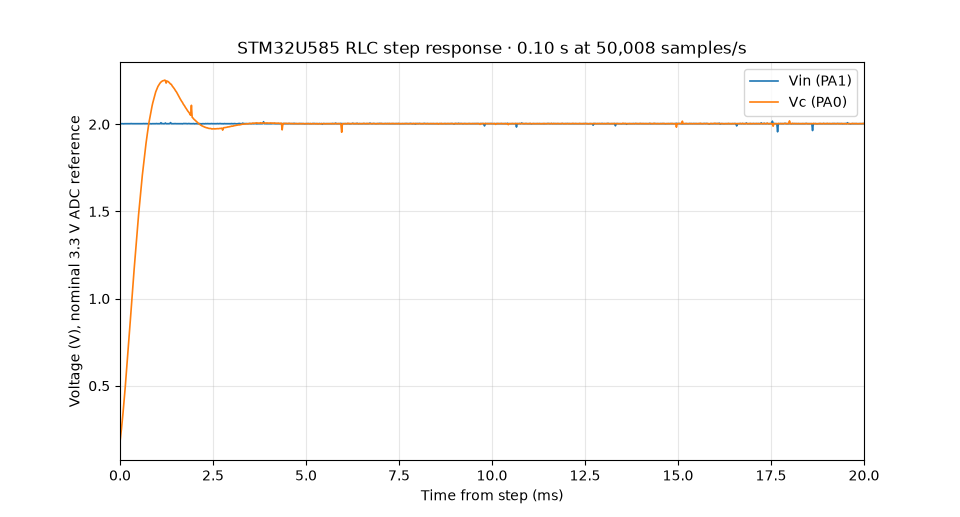
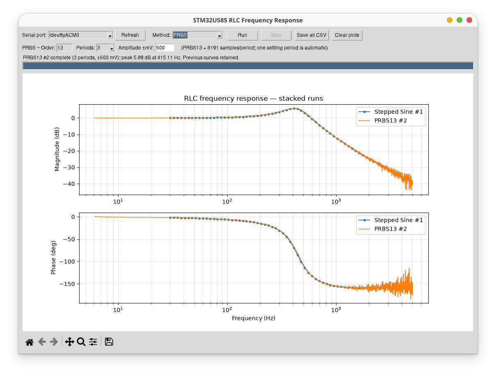

# STM32U585 RLC Frequency Response — Stepped Sine + PRBS

This version keeps the STM32U585 as the waveform generator/data-acquisition unit and moves FRF estimation and comparison to Python.

## Wiring

- PA4 / DAC1_OUT1 -> R -> L -> capacitor node
- PA1 / ADC1_IN6 -> measured Vin at the DAC/R node
- PA0 / ADC1_IN5 -> measured Vc at the capacitor node
- common GND

## Methods

### Stepped Sine

The MCU generates one sine frequency at a time. Python performs a synchronous single-frequency DFT on measured Vin and Vc and computes `H = Vc/Vin`.

### PRBS13

The MCU generates a deterministic 13-bit maximum-length PRBS (`8191` samples/period), centered at 1.65 V. One complete period is used for settling, then 1–3 aligned periods are captured. Python averages auto/cross spectra across the repeated periods and computes the H1 estimator:

`H1 = S_yx / S_xx`

as well as magnitude, phase, and coherence.

Default PRBS settings are 3 periods and ±600 mV. At 50 ksample-pairs/s one PRBS13 period lasts about 0.164 s, so three captured periods provide ~6.1 Hz frequency spacing.

## Stack/compare plots

Each completed run remains on the Bode plots. Matplotlib's normal color cycle gives each new run a different color. Use **Clear plots** to remove all retained runs. **Save all CSV** exports all retained curves with a run number and method label.

## Build and run

```bash
pio run -t upload
python host/rlc_frf_u585.py
```

Python dependencies are listed in `requirements.txt`.

The build uses `-O3`; `-ffast-math` and forced loop unrolling are intentionally not enabled.


## Reliability update

The USB CDC transmitter now handles partial `Serial.write()` returns and sends ADC payloads in 256-byte chunks. The host sine timeout is also increased to 12 s. This prevents intermittent truncated low-frequency sine frames, which are the largest records in a sweep.

## Some results





