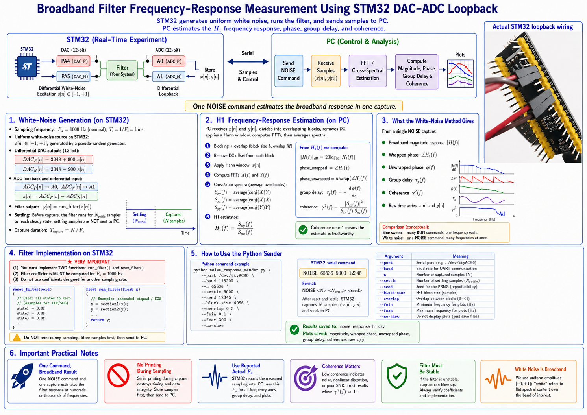

# Broadband Filter Frequency-Response Measurement Using STM32 DAC–ADC Loopback

## Super short technical summary

This note documents a **white-noise / broadband frequency-response method** for validating a digital filter running on an STM32 board.

The STM32 performs the real-time experiment:

```text
DAC white-noise generation -> ADC loopback -> filter -> store x[n], y[n]
```

The PC controls the experiment and computes the frequency response:

```text
PC sends one NOISE command -> STM32 returns samples -> PC estimates H1(f)
```

Unlike the sine-sweep method, which sends one `RUN` command per frequency, the white-noise method sends only one command and estimates many frequencies at once.

```text
Swept sine : many RUN commands, one frequency per command
White noise: one NOISE command, broadband response from one capture
```

The frequency response is estimated using the H1 estimator:

$$
H_1(f)=\frac{S_{xy}(f)}{S_{xx}(f)}
$$

where

$$
S_{xy}(f)=\operatorname{average}\left(X^*(f)Y(f)\right)
$$

and

$$
S_{xx}(f)=\operatorname{average}\left(X^*(f)X(f)\right).
$$

This gives a fast broadband estimate of the magnitude, phase, group delay, and coherence of the embedded filter.


## Summary in poster




## 1. Hardware Signal Path

The loopback wiring is the same as the sine-sweep method:

```text
PA4 / A4  -> PA0 / A0
PA5 / A5  -> PA1 / A1
GND       -> GND
```

The STM32 uses two DAC outputs and two ADC inputs:

```text
PA4 = DAC positive output
PA5 = DAC negative output
A0  = ADC positive input
A1  = ADC negative input
```

The differential input signal is computed in firmware as:

$$
x[n] = ADC_P[n] - ADC_N[n].
$$

The digital filter is then executed as:

$$
y[n] = \operatorname{filter}(x[n]).
$$

The STM32 stores both signals:

```text
x_buf[n] = measured input
y_buf[n] = filter output
```

and sends them to the PC after capture.


## 2. White-Noise Generation on STM32

### 2.1 Sampling frequency

The STM32 uses the nominal sampling frequency:

$$
F_s = 1000 \; \text{Hz}
$$

so the sampling period is:

$$
T_s = \frac{1}{F_s} = 1 \; \text{ms}.
$$

The filter coefficients must be computed for the same sampling rate used by `run_filter()`:

$$
F_s = 1000 \; \text{Hz}.
$$

Do not use coefficients designed for another sampling rate unless the firmware sampling rate is also changed.


### 2.2 Uniform white-noise source

For the white-noise method, the STM32 generates a random value:

$$
s[n] \in [-1,1]
$$

using a pseudo-random number generator.

In the current firmware, the noise is **uniform white noise**. This means the amplitude samples are uniformly distributed, while the sequence is broadband in frequency.

The DAC outputs are:

$$
DAC_P[n] = 2048 + 900s[n],
$$

$$
DAC_N[n] = 2048 - 900s[n].
$$

The ADC loopback input is:

$$
x[n] = ADC_P[n] - ADC_N[n].
$$

So ideally:

$$
x[n] \approx 1800s[n].
$$

This produces a zero-centered broadband excitation after the differential subtraction.


### 2.3 Why white noise is useful

White noise excites many frequencies at once. Therefore, the PC can estimate the response over a broad frequency range from one capture.

This is different from sine sweep:

```text
Sine sweep:
  RUN 0.5 ...
  RUN 1 ...
  RUN 2 ...
  RUN 5 ...
  ...
```

White-noise method:

```text
NOISE 65536 5000 12345
```

So the white-noise method is faster for broadband characterization.


## 3. How to Use the White-Noise Sender

The Python script is:

```text
noise_response_sender.py
```

The STM32 firmware must support the command:

```text
NOISE <N> <settle_N> <seed>
```

For example:

```text
NOISE 65536 5000 12345
```

means:

```text
N        = 65536 captured samples
settle_N = 5000 settling samples before capture
seed     = 12345 pseudo-random seed
```

The PC command is:

```bash
python noise_response_sender.py \
  --port /dev/ttyACM0 \
  --baud 115200 \
  --n 65536 \
  --settle 5000 \
  --seed 12345 \
  --block-size 4096 \
  --overlap 0.5 \
  --fmin 0.1 \
  --fmax 300 \
  --no-show
```


### 3.1 Meaning of `N` and `settle`

The command:

```text
NOISE N settle_N seed
```

does **not** mean that the first `settle_N` samples are removed from `N`.

Instead, STM32 performs two stages:

```text
settle_N samples -> generated and filtered, but not stored
N samples        -> generated, filtered, stored, and sent to PC
```

For example:

```text
NOISE 65536 5000 12345
```

means the STM32 runs:

$$
5000 + 65536 = 70536
$$

samples total.

The first 5000 samples are used only to let the filter settle. They are discarded inside the STM32 firmware.

The PC receives only the final 65536 captured samples.

With:

$$
F_s = 1000 \; \text{Hz},
$$

the settling duration is:

$$
T_{\text{settle}} = \frac{5000}{1000} = 5.000 \; \text{s},
$$

and the capture duration is:

$$
T_{\text{capture}} = \frac{65536}{1000} = 65.536 \; \text{s}.
$$


## 4. STM32 Serial Protocol

The PC sends:

```text
NOISE <N> <settle_N> <seed>
```

The STM32 replies:

```text
OK,NOISE,<N>,<settle_N>,<seed>
BEGIN,NOISE,0.000000,<actual_fs_hz>,<N>,<missed_deadlines>
DATA,0,<x0>,<y0>
DATA,1,<x1>,<y1>
DATA,2,<x2>,<y2>
...
END
```

where:

```text
x[n] = measured input from ADC loopback
y[n] = digital filter output
```

The `BEGIN` line reports the actual measured sampling rate:

```text
actual_fs_hz
```

The Python script should use this reported value for frequency-axis calculations.


## 5. Output Files

By default, the white-noise sender creates:

```text
noise_output/
```

Inside it, the script saves:

```text
noise_output/noise_response_h1.csv
noise_output/noise_magnitude_h1.png
noise_output/noise_phase_wrapped_h1.png
noise_output/noise_phase_unwrapped_h1.png
noise_output/noise_group_delay_h1.png
noise_output/noise_coherence.png
noise_output/noise_time_input_output.png
noise_output/noise_raw.csv
```

The main result is:

```text
noise_magnitude_h1.png
```

The quality-check plot is:

```text
noise_coherence.png
```

If the coherence is near 1, the estimate is trustworthy.

If coherence drops badly, the result in that frequency region may be affected by noise, poor excitation, nonlinear distortion, or output near the noise floor.


## 6. H1 Frequency-Response Estimation

The PC receives two time-domain signals:

$$
x[n] = \text{measured input},
$$

$$
y[n] = \text{filter output}.
$$

The signal is split into overlapping blocks. For each block:

1. remove the DC offset,
2. apply a Hann window,
3. compute FFT of input and output,
4. average the spectra across blocks.


### 6.1 FFT of input and output

For one block:

$$
X(f) = \operatorname{FFT}\{x[n]\},
$$

$$
Y(f) = \operatorname{FFT}\{y[n]\}.
$$

The input auto-spectrum estimate is:

$$
S_{xx}(f) = \operatorname{average}\left(X^*(f)X(f)\right).
$$

The input-output cross-spectrum estimate is:

$$
S_{xy}(f) = \operatorname{average}\left(X^*(f)Y(f)\right).
$$

Then the H1 estimator is:

$$
H_1(f)=\frac{S_{xy}(f)}{S_{xx}(f)}.
$$

This estimates the transfer function from input \(x[n]\) to output \(y[n]\).


### 6.2 Magnitude response

The magnitude response is:

$$
|H_1(f)|
$$

and in decibels:

$$
|H_1(f)|_{\text{dB}} = 20\log_{10}|H_1(f)|.
$$

This produces a broadband magnitude plot from a single noise capture.


### 6.3 Phase response

The wrapped phase is:

$$
\phi_{\text{wrapped}}(f)=\angle H_1(f).
$$

The unwrapped phase is obtained by removing \(360^\circ\) jumps between neighboring frequency bins:

$$
\phi_{\text{unwrapped}}(f)=\operatorname{unwrap}(\angle H_1(f)).
$$

Wrapped phase is useful for conventional Bode plots.

Unwrapped phase is useful for computing group delay.


### 6.4 Group delay

Group delay is computed from the unwrapped phase:

$$
\tau_g(f) = -\frac{d\phi(f)}{d\omega},
$$

where:

$$
\omega = 2\pi f.
$$

In Python, this is approximated numerically as:

```python
group_delay_s = -np.gradient(phase_unwrapped_rad, omega)
```

Group delay tells how much the filter delays frequency components.


### 6.5 Coherence

Coherence is computed as:

$$
\gamma^2(f)=
\frac{|S_{xy}(f)|^2}{S_{xx}(f)S_{yy}(f)}.
$$

where:

$$
S_{yy}(f) = \operatorname{average}\left(Y^*(f)Y(f)\right).
$$

Coherence satisfies:

$$
0 \leq \gamma^2(f) \leq 1.
$$

A value near 1 means the output is strongly explained by the input through a linear system.

A low value may indicate:

```text
noise floor
nonlinear distortion
poor excitation
timing problems
filter output too small
```


## 7. Choosing Block Size and Overlap

The FFT frequency resolution is:

$$
\Delta f = \frac{F_s}{L},
$$

where \(L\) is the FFT block size.

For example, with:

$$
F_s = 1000 \; \text{Hz}
$$

and:

$$
L = 4096,
$$

we get:

$$
\Delta f = \frac{1000}{4096} \approx 0.244 \; \text{Hz}.
$$

Using a larger block size improves frequency resolution:

$$
L = 8192 \Rightarrow \Delta f \approx 0.122 \; \text{Hz}.
$$

But a larger block size gives fewer averaged blocks for the same capture length, so the response may become noisier.

A good starting point is:

```text
N          = 65536
block_size = 4096
overlap    = 0.5
```

This gives many blocks for averaging and good response smoothness.


## 8. White Noise vs Sine Sweep

| Method | Command Count | Main Advantage | Main Weakness |
||:|||
| Sine sweep | many | clean gain/phase at selected frequencies | slow |
| White noise H1 | one | broadband response from one capture | noisier, needs averaging and coherence check |

Sine sweep is useful as a precise reference.

White-noise H1 estimation is useful for fast broadband characterization and system-identification-style analysis.

A good lab sequence is:

```text
1. Swept-sine frequency response
2. White-noise H1 frequency response
3. Compare both magnitude plots
4. Discuss coherence, noise floor, and averaging
```


## 9. Important Practical Notes

### 9.1 Do not print during sampling

Serial printing is slow and non-deterministic. Therefore, STM32 must not print inside the sampling loop.

The firmware captures all samples first:

```text
x_buf[n], y_buf[n]
```

Only after capture is complete does STM32 send the data to the PC.


### 9.2 Use actual reported sampling frequency

The STM32 reports:

```text
BEGIN,NOISE,0.000000,actual_fs,N,missed_deadlines
```

The PC should use `actual_fs`, not only the nominal \(F_s\).


### 9.3 Uniform white noise is not Gaussian noise

The current firmware uses uniform white noise:

$$
s[n]\in[-1,1].
$$

This is fine for frequency-response estimation. The term “white” refers mainly to the broadband spectral content, not the amplitude distribution.

Gaussian white noise is also possible, but uniform noise is simpler and safer on embedded hardware.


### 9.4 Avoid clipping

The DAC output is limited:

$$
0 \leq DAC \leq 4095.
$$

The current excitation is:

$$
DAC = 2048 \pm 900s[n].
$$

Since \(s[n]\in[-1,1]\), the DAC range is approximately:

$$
1148 \leq DAC \leq 2948.
$$

So it stays safely inside the 12-bit DAC range.


### 9.5 Coherence matters

The H1 estimate should be interpreted together with coherence.

A clean result usually has:

$$
\gamma^2(f) \approx 1
$$

inside the frequency band where the input is strong and the output is not buried in noise.

Stopband regions may have lower coherence because the output is very small.


## 10. Summary

The white-noise method uses one broadband excitation:

$$
s[n]\in[-1,1].
$$

The STM32 generates differential DAC signals:

$$
DAC_P[n] = 2048 + 900s[n],
$$

$$
DAC_N[n] = 2048 - 900s[n].
$$

The measured input is:

$$
x[n] = ADC_P[n] - ADC_N[n].
$$

The filter output is:

$$
y[n] = \operatorname{filter}(x[n]).
$$

The PC estimates the frequency response using:

$$
H_1(f)=\frac{S_{xy}(f)}{S_{xx}(f)}.
$$

It also computes:

```text
magnitude
wrapped phase
unwrapped phase
group delay
coherence
```

This provides a fast broadband frequency-response measurement of the actual digital filter running on STM32.
